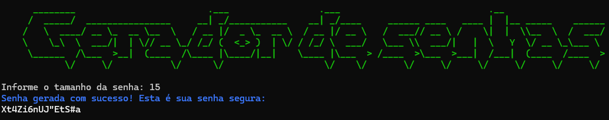

# Gerador de Senhas Seguras

  

Este é um simples gerador de senhas seguras em Python. Ele permite que você gere senhas aleatórias usando uma combinação de letras (maiúsculas e minúsculas), números e caracteres especiais.

## Como usar

1. Execute o script `gerador_senhas.py`.
2. Siga as instruções para informar o tamanho da senha desejada.
3. Uma senha segura será gerada e exibida na tela.

## Exemplo de uso

python gerador_senhas.py

## Exemplo de saída

Bem-vindo ao Gerador de Senhas Seguras!

Informe o tamanho da senha: 12
Senha gerada com sucesso! Esta é sua senha segura:
wN*7hQ@p3#V2

## Requisitos

- Python 3.x

## Autor

Seu Nome

## Licença

Este projeto está sob a licença [MIT](https://opensource.org/licenses/MIT).
